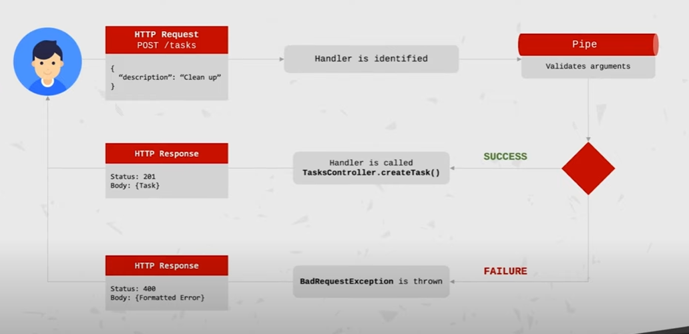

# Task Management Application

## Application Structure

## AppModule (root)

- TasksModule

  - TasksController
  - TaskEntity
  - TaskService
  - TaskRepository
  - Status ValidationPipe

- AuthModule
  - AuthController
  - UserRepository
  - AuthService
  - JwtStrategy
  - UserEntity

## Objectives: NestJs

- NestJS Modules
- NestJS Controllers
- NestJS Services and Providers
- Controller-to-Services communication
- Validation using NestJS Pipes

## Objectives: Back-end & Architecture

- Develop production-ready REST APIs
- CRUD operations (Create, Read, Update, Delete)
- Error Handling
- Data Transfer Objets (DTO)
- System modularity
- Back-end development best practices
- Configuration Management
- Logging
- Secuirity best practices

## Objectives: Persistence

- Connecting the application to a database
- Working with relational database
- Using TypeORM
- Writing simple and complex queries using QueryBuilder
- Performance when working with a database

## Objectives: Authorization/Authentication

- Signing up, signing in
- Authentication and Authorization
- Protected resources
- Ownership of tasks by users
- Using JWT tokens (JSON Web Token).
- Password hashing, salts and properly storing passwords

## NestJS Module

- Each application has at least one module - the root module. That is the starting point of the application.
- Modules are an effective way to organize components by a closely related set of capabilities( e.g. per feature).
- It is a good practice to have a folder per module, containing the module's componets.
- Modules are singletons, therefore a module can be imported by multiple other modules.

### Defining a module

- A module is defined by annotating a class with the `@Module` decorator.
- The decorator provides metadata that Nest uses to organize the application structure.

## @Module Decorator Properties

- `providers: ` Array of providers to be available within the module via dependency injection.
- `controller: ` Array of controllers to be instantiated within the module.
- `exports: ` Array of providers to export to other modules.
- `imports: ` List of modules required by this module. Any exported provider by these modules will now be available in our module via dependency injection.

## NestJs Controllers

- Responsible for handling incomming `requests` and returning `response` to the client.
- Bound to a specific `path` (for example, "/tasks" for the task resource).
- Contain `handlers,` which handle `endpoints` and `request methods` (GET, POST, DELETE etcetera).
- Can take advantage of `dependency injection` to consume providers within the same module.

## Defining a controller

- Controllers are defined by decorating a class with the `@Controller` decorator.
- The decorator accepts a string, which is the `path` to be handled by the controller

```ts
@Controller('/tasks)
export class TasksController {
    // ...
}
```

## Defining a Handler

- Handlers are simply methods within the controller class, decorated with decorators such as` @Get,` `@Post,` `@Delete` etcetera.

```ts

@Controller('/tasks)
export class TasksController {
   @Get()
   getAllTasks(){
    //do stuff

    return ...;
   }

   @Post()
   createTask() {
     //do stuff

    return ...;
   }
}

```

## HTTP request incomming

- Request route to Controller, handler is called with arguments
  - NestJS will parse the relevant request data and it will be available in the handler.
- Hanler hanldes the request
  - Perform operations such as communication with a service. For example, retrieving an item from the database
- Handler returns response value

  - Response can be of any type and even an exception.
  - Nest will wrap the returned value as an HTTP response and return it to the client.

- `AuthController` <br>
  /auth

  `signin()` <br>
  POST /auth/signin

  `signout()` <br>
  POST /auth/signout

- `TasksController` <br>
  /tasks

  `getAllTasks()` <br>
  GET /tasks

  `getTaskById()` <br>
  GET /tasks/:id

  `createTask()` <br>
  POST /tasks

  `deleteTask()` <br>
  DELETE /tasks/:id

  `updateTaskStatus()` <br>
  PATCH /tasks/:id

- `UsersController` <br>
  /tasks

  `getAllUsers()` <br>
  GET /users

  `createUser()` <br>
  POST /users

  `deleteUser()` <br>
  DELETE /users/:id

## NestJS Providers

- Can be injected into constructors if decorated as an `@Injectable`, via `dependency injection.`
- Can be a plain value, a class, sync/async factory etc.
- Providers must be provided to a module for them to be usable.
- Can be exported from a module - and then be available to other modules that import it.

## What is a Service?

- Defined as providers. `Not all providers are services.`
- Common concept within software development and are not exclusive NestJS, JavaScript or back-end development.
- Singleton when wrapped with `@Injectable()` and provided to a module. That means, the same instance will be shared across the application - acting as a single source of truth.
- The main source of business logic. For example, a service will be called from a controller to validate data, create an item in the database and return a response.
- Module
  - Controller
    - Service A
    - Service B
    - Service C
- Example:

  ```ts
  import { TasksController } from './tasks.controller';
  import { TasksService } from './tasks.service';
  import { LoggerService } from './shared/logger.service';

  @Module({
    controllers: [TasksController],
    providers: [TasksService, LoggerService],
  })
  export class TasksModule {}
  ```

## Dependency Injection in NestJS

- Any component within the NestJS ecosystem can inject a provider that is decorated with the `@Injectable.`
- We define the dependencies in the constructor of the class. NestJs will take care of the injection for us, and will then be available as a class property.
- Example

  ```ts
  import { TasksService } from './tasks.service';

  @Controller('/tasks)
  export class TasksController {
      constructor(private tasksService: TasksService ) {}

      @Get()
      async getAllTasks() {
          return await this.tasksService.getAllTasks();
      }
  }

  ```

## Data Transfer Object (DTO)

- "A data transfer object (DTO) is an object that carries data between processes." - "Data Transfer Object", Wikipedia
- "A data transfer object is an object that is used to encapsulate data, and send it from one subsystem of an application to another." - "What is a Data Transfer Object", StackOverflow

- "A DTO is an object that defines how the data will be sent over the network." - NestJS Documentation
- More about DTOs
  - Common concept in software development that is not specific to NestJS.
  - Result in more bulletproof code, as it can be used as a TypeScript type.
  - Do not have any behavior except for storage, retrieval, serialization and deseialization of its own data.
  - Result in increased performance (although negligible in small applications).
  - Can be usefull for data validation.
  - A DTO is `NOT` a model definition. It defines the shape of data for a specific case, for example - creating a task.
  - Can be defined using an `interface` or a class.

### Classes VS Interface for DTOs

- Data Transfer Objects (DTOs) can be defined as classes or interfaces.
- The recommended approach is to use `classes,` also clearly documented in the NestJS documentation.
- Classes allow us to do more, and since they are a part of JavaScript, they will be preserved post-compilation.
- NestJS cannot refer to interfaces in run-time, but can refer to classes.
- `TLDR: Classes are the way to go for DTOs.`

### Important note! (DTOs)

- Data Transfer Objects are `NOT` mandatory.
- You can still develop applications without using DTOs.
- However, the value they add makes it worthwhile to use them when applicable.
- Applying the DTO pattern as soon as possible will make it easy for you to maintain and refactor your code.

## NestJS Pipes

- Pipes operate on the `arguments` to be processed by the route handler, just before the handler is called.
- Pipes can perform `data transformation` or `data validation`.
- Pipes can return data - either orginal or modified - which will be passed on to the route handler.
- Pipes can throw exceptions. Exceptions thrown will be handled by NestJs and parsed into an error response.
- Pipes can be asynchronous.

  ### Default Pipes in NestJS

  NestJS ships with useful pipes within the @nestjs/common module.

  ### validationPipe

  - Validates the compatibility of an entire object against a class (goes well with DTOs, or Data Transfer Objects). If any property cannot be mapped properly (for example, mismatching type) validation will fail.
  - A very common use case, therefore having a built-in validation pipe is extremely useful.

  ### ParseIntPipe

  - By default arguments are of type `String`. This pipe validates that an arguments is a number. If successful, the argument is transformed into a `Number` and passed on to the handler.

  ### Custom Pipe Implementation

  - Pipes are classes annotated with the @Injectable() decorator.
  - Pipes must implement the `PipeTransform` generic interface. Therefore, every pipe must have a `transform()` method. This method will be called by NestJS to process the arguments.
  - The `transform()` method accepts two parameters:
    - `value: ` the value returned of the processed argument.
    - `metadata:` ()
  - Whatever is returned from the `transform()` method will be passed on to the route handler. Exceptions will be sent back to the client.
  - Pipes can be consumed in different ways.
  - `Handler-level-pipes` are defined at the handler level, via the `@UsePipes()` decorator. Such pipe will process all parameters for the incoming requests.

  ```ts
  @Post()
  @UsePipes(SomePipe)
  createTask(@Body('description) description) {
    // ...
  }
  ```

  - `Gloabl pipes` are defined at the application level and will be applied to any incoming request.

  ```ts
  async function bootstrap() {
    const app = await NestFactory.create(ApplicationModule);
    app.useGlobalPipes(SomePipe);
    await app.listen(3000);
  }
  bootstrap();
  ```

### Parameter-level VS Handler-level pipes. Which one?

It depends.

- `Parameter-level pipes` tend to be slimmer and cleaner. However, they often result in extra code added to handlers - this can get messy hard to maintain.

- `Handler-level pipes` require some more code, but provide some great benefits:

  - Such pipes do not require extra code at the parameter level.
  - Easier to maintain and expand. If the shape of the data changes, it is easy to make the necessary changes within the pipe only.
  - Responsibility of identifying the arguments to process is shifted to one central file - the pipe file.
  - Promote usage of DTOs (Data Transfer Objects) which is a very good practice.

  <p align="center">
    
  </p>

- `npm install class-validator class-transformer --save`
